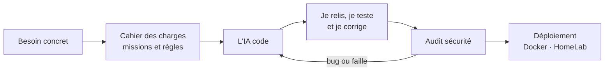

# Evann Bougoula · `dagonk49`

### Je pilote des projets informatiques avec l'IA. Elle code. Moi, je cadre, je relis, je corrige et je traque les failles.

Alternant technicien informatique à la **DSI régionale de l'Établissement Français du Sang** · **BTS SIO SISR** · Angers

---

## 🧭 Mon approche

Je ne me présente pas comme développeur. Sur mes projets, **c'est l'IA qui écrit le code**. Mon travail, c'est tout le reste :

- **Cadrer** : partir d'un besoin réel, écrire le cahier des charges, découper le travail en missions claires avec des règles strictes.
- **Faire produire** : piloter des assistants de code IA (agents configurés avec instructions, mémoire et skills dédiés).
- **Relire et corriger** : vérifier ce qui sort, tester, lire les logs, renvoyer en correction quand ça ne tient pas.
- **Chercher les failles** : auditer la sécurité (entrées utilisateur, CORS, droits admin, secrets, fuites mémoire…).
- **Déployer et exploiter** : conteneuriser et faire tourner le tout sur mon propre HomeLab.

---

## 🚀 Projets concrets

### 🛰️ NetForge — du plan d'adressage à la console Cisco

> Outil web gratuit pour concevoir un réseau de A à Z, né d'un besoin rencontré en cours et en TP : découper les plages, suivre les attributions, écrire les configs… à la main, c'est long et source d'erreurs.

- Calcul **VLSM / FLSM** sur plusieurs réseaux parents, liens /31 et hôtes /32
- **VLAN, DHCP** et carte visuelle de l'espace d'adressage
- **Topologie en glisser-déposer** avec détection des boucles, des doublons d'IP et des liaisons de transit /30
- **Génération de configurations** pour 17 plateformes de 13 constructeurs (Cisco, Juniper, Aruba, Huawei, MikroTik, Fortinet, Palo Alto…) + scripts Windows, Linux et macOS
- Exports **PDF, PNG, TXT**
- **100 % local** : calculs dans le navigateur, projets en IndexedDB, sans compte ni traceur

**Mon rôle :** définir le besoin et le cahier de recette (cas VLSM, détection de chevauchement, trunks 802.1Q générés), valider les calculs d'adressage et les configs produites, imposer une conception sans collecte de données, conteneuriser et publier l'outil.

[-555?style=flat-square&logo=github)](https://github.com/dagonk49/NETFORGE-V4)

---

### 🎬 DagzFlix — mon hub de streaming façon Netflix

> Interface de streaming et de découverte branchée sur mon serveur **Jellyfin** et sur **Jellyseerr / TMDB**. Quatre itérations publiques, de la V0 à la V4.

- Algorithme de recommandation maison **DagzRank** (score sur 7 couches : genres favoris, historique, notes, fraîcheur, télémétrie…)
- **Contrôle parental** par rôles (admin / adulte / enfant) et **panneau d'administration**
- Lecteur **HLS** multi-pistes audio et sous-titres, reprise intelligente des séries, favoris, notes
- Stack : Next.js 14 avec BFF + MongoDB (v3) · React + FastAPI (V4)

**Ce que montre ce projet côté pilotage :**

| | |
|---|---|
| 📋 **Versioning imposé à l'IA** | 19 versions documentées en 8 jours (V0,001 → V0,011) : chaque demande = date, objectif, fichiers touchés, validation |
| 🐛 **Débogage sur logs réels** | 3 rounds d'analyse après une régression, jusqu'à **0 erreur 500** sur la session de monitoring |
| 🛡️ **Audit sécurité (V0,009)** | Validation des entrées avec Zod, assainissement des identifiants, contrôle d'origine CORS, contrôle admin centralisé, proxy d'images en streaming contre les fuites mémoire |
| 🏗️ **Refactoring** | Un fichier de **3 275 lignes** découpé en **11 modules**, contrat d'API strictement identique (25 GET + 13 POST) |
| 🔐 **Sécurité dès la conception (V4)** | Hachage Argon2id, chiffrement AES-256-GCM des clés API, cookies HttpOnly / SameSite Strict, rate limiting, en-têtes de sécurité |

---

### 🧪 EVANN // ROOT ACCESS — un portfolio qui se joue

> [evann-bougoula.dagz.fr](https://evann-bougoula.dagz.fr) : une lecture sobre et accessible pour aller à l'essentiel, ou un **lab 3D** où l'on remet une petite infrastructure en ligne.

- **Mission réseau simulée** : brassage, VLAN d'accès, adressage IPv4, diagnostic `ipconfig` / `ping` calculé à partir de l'état du lab
- **Terminal CLI** intégré et circuit 3D extérieur avec physique de véhicule
- Une seule source de données pour le mode sobre, le mode 3D et le terminal
- Aucun cookie publicitaire, aucune mesure d'audience, référencement travaillé
- Stack : Next.js, React, TypeScript, Three.js, Rapier

---

### 🏠 HomeLab — l'infra qui fait tourner tout ça

> L'IA écrit le code. L'hébergement, le réseau et la sécurité de l'infrastructure, c'est mon terrain.

- **Proxmox VE** : une VM Docker principale (plus de la moitié des ressources) qui héberge NetForge, ce portfolio, Jellyfin, un staging privé et des automatisations
- **VM de test** : Windows Server 2022 et 2025, Debian, Windows 11
- **Sécurisation** : segmentation VLAN, accès distant par **WireGuard**, publication des services derrière **Nginx Proxy Manager**

---

## 🛠️ En entreprise

| Où | Ce que j'y fais / fait |
|---|---|
| **EFS** · DSI régionale (alternance, depuis 2026) | Support N1, gestion des comptes et accès Active Directory, masterisation et déploiement du parc, programme national AMI |
| **NET4BUSINESS** (stage 2026) | Support d'installation Windows automatisé et personnalisé avec **Ventoy** |
| **NET4BUSINESS** (stage 2025) | Hyperviseur **Proxmox VE sous Debian** + script de nettoyage des applications Windows |
| **NET4BUSINESS** (stage 2024) | Wi-Fi **Ubiquiti UniFi** avec réseaux invités et privé isolés par VLAN |

🎓 **BTS SIO SISR** (MyDigitalSchool Angers, 2026-2028) · **Bac Pro CIEL** mention très bien
📜 Cisco Networking Academy (introduction à la cybersécurité) · Pix · SST · Habilitation électrique B1V

---

## 🧰 Outils

**Infra & réseau**

**Technologies des projets que je pilote**

**IA**

---

**L'IA va vite. Mon job, c'est qu'elle aille dans la bonne direction, sans laisser de porte ouverte.**

📍 Angers · Nantes · Ancenis · Candé — présentiel ou télétravail

