<!-- ═══════════════════════════════  EN-TÊTE  ═══════════════════════════════ -->

<div align="center">


<br/>

[](https://evann-bougoula.dagz.fr)
[](https://netforge.dagz.fr)
[](https://www.linkedin.com/in/evann-bougoula)
[](https://evann-bougoula.dagz.fr/CV_Evann_Bougoula.pdf)


</div>

###  Salut, moi c'est Evann




##  Mes domaines

<table>
<tr>
<td width="33%" valign="top">

###  Systèmes
- **Proxmox VE** — en stage et dans mon lab
- **Docker / Compose**
- **Windows Server** 2022 · 2025
- **Active Directory** — comptes, accès, conformité
- **Debian** · Hyper-V
- Masterisation et déploiement de postes (**Ventoy**)
- Scripts **PowerShell**, déploiement via **Datto RMM**

</td>
<td width="33%" valign="top">

###  Réseaux
- **VLAN**, trunks 802.1Q, routage inter-VLAN
- Adressage **IPv4** et découpage **VLSM**
- **Cisco IOS** en ligne de commande
- **Ubiquiti UniFi** — Wi-Fi invités / privé
- DHCP · NAT · OSPF
- Câblage cuivre et fibre optique

</td>
<td width="33%" valign="top">

###  Sécurité
- Segmentation du réseau par **VLAN**
- Accès distant **WireGuard**
- Reverse proxy et **TLS** (Nginx Proxy Manager)
- Filtrage DNS **AdGuard Home**
- Sauvegardes cloud **Wasabi**
- Conteneurs durcis, en-têtes HTTP, CSP
- Relecture sécurité du code produit par l'IA

</td>
</tr>
</table>


##  Mon HomeLab

> Mon terrain d'expérimentation au quotidien. C'est lui qui héberge tous mes projets publiés sur **dagz.fr**.



| Brique | Rôle |
|---|---|
| **Proxmox VE** | Hyperviseur : une VM Docker de production et des VM de test séparées |
| **Docker** | NetForge, portfolio, Jellyfin, staging privé de préproduction, automatisations |
| **Nginx Proxy Manager** | Publication des services et certificats TLS |
| **WireGuard** | Accès distant sans exposer l'administration |
| **VLAN** | Isolation des environnements de test et de production |


##  NetForge — du plan d'adressage à la console

<a href="https://netforge.dagz.fr"></a>
<a href="https://netforge.dagz.fr"></a>
<a href="https://hub.docker.com/r/dagonk/netforge-engine"></a>


> Né d'un besoin rencontré en cours et en TP : découper les plages, suivre les attributions et écrire les configs à la main, c'est long et source d'erreurs. NetForge relie la conception théorique aux commandes réellement tapées sur les équipements.



| | |
|---|---|
| 🧮 **Adressage** | Calcul VLSM / FLSM sur plusieurs réseaux parents, liens /31, hôtes /32, prévention des chevauchements |
| 🏷️ **VLAN & services** | VLAN nommés, DHCP, carte visuelle de l'espace d'adressage (IPAM léger) |
| 🗺️ **Topologie** | Schéma en glisser-déposer, détection des boucles, des doublons d'IP et des liaisons de transit /30 |
| ⚙️ **Configurations** | 17 plateformes de 13 constructeurs : Cisco IOS / NX-OS / ASA, Juniper, Arista, Aruba, Huawei, MikroTik, Fortinet, Palo Alto… + scripts Windows, Linux, macOS |
| 📄 **Exports** | Plan d'adressage et dossier d'infrastructure en PDF, schéma en PNG, configs en TXT |
| 🔒 **Confidentialité** | 100 % local : calculs dans le navigateur, projets en IndexedDB, aucun compte, aucun traceur |

<details>
<summary><b>Voir un extrait de configuration Cisco IOS générée</b></summary>

```cisco
! NetForge · SW-CORE · Catalyst 3560
hostname SW-CORE
ip routing
!
vlan 10
 name Prod
vlan 20
 name Voix
!
interface GigabitEthernet0/1
 switchport trunk encapsulation dot1q
 switchport mode trunk
 switchport trunk allowed vlan 10,20
!
interface Vlan10
 ip address 192.168.1.1 255.255.255.192
!
router ospf 1
 network 192.168.1.0 0.0.0.63 area 0
```

</details>

**Mon rôle :** définir le besoin, écrire le cahier de recette (cas VLSM, détection de chevauchement, trunks générés), valider chaque calcul et chaque config produite, conteneuriser l'application et la publier sur mon lab.


##  Réalisations en entreprise

<table>
<tr>
<td colspan="2" valign="top">

### 🩸 Établissement Français du Sang — DSI régionale
<sub>Alternance · depuis septembre 2026 · Angers</sub>

Support **N1** · gestion des comptes et des accès **Active Directory** (conformité et pérennité de l'annuaire) · **masterisation, déploiement et maintenance** du parc régional · participation au **programme national AMI**

</td>
</tr>
<tr>
<td width="50%" valign="top">

### 💿 Déploiement Windows automatisé
<sub>NET4BUSINESS · stage · 2026</sub>

Clé **Ventoy** multi-images, installation de Windows automatisée et personnalisée selon chaque client, mise en service de portables en entreprise.

</td>
<td width="50%" valign="top">

### 🗄️ Hyperviseur Proxmox VE sous Debian
<sub>NET4BUSINESS · stage · 2025</sub>

Mise en place d'un hyperviseur **Proxmox VE** sur **Debian** pour héberger des VM, et script de désinstallation des applications inutiles sur les postes Windows.

</td>
</tr>
<tr>
<td width="50%" valign="top">

### 📶 Wi-Fi Ubiquiti UniFi segmenté
<sub>NET4BUSINESS · stage · 2024</sub>

Réseaux **invités** et **privé** isolés par **VLAN** : un invité accède à Internet sans jamais voir les ressources internes.

</td>
<td width="50%" valign="top">

### 🛡️ Sécurité et administration
<sub>NET4BUSINESS · stages</sub>

Filtrage DNS avec **AdGuard Home**, scripts **PowerShell** déployés via **Datto RMM**, sécurisation des sauvegardes cloud **Wasabi**, **Active Directory**.

</td>
</tr>
</table>


##  Portfolio — EVANN // ROOT ACCESS

<a href="https://evann-bougoula.dagz.fr"></a>
<a href="https://evann-bougoula.dagz.fr"></a>
<a href="https://github.com/dagonk49/portefolio-Evann-BOUGOULA"></a>

> Mon portfolio est aussi un projet d'infra : conteneurisé, durci et auto-hébergé sur mon lab.

<table>
<tr>
<td width="50%" valign="top">

**🔧 Côté infra**
- Build multi-étapes vers une image **nginx non privilégiée**
- Compose durci : système de fichiers **en lecture seule**, toutes les capabilities retirées, `no-new-privileges`
- Publication via **Nginx Proxy Manager** (TLS)
- **En-têtes de sécurité** et **CSP** stricte, aucun domaine externe appelé
- Formulaire de contact isolé dans **son propre conteneur** : contrôle d'origine, limitation de débit, champ piège, aucun stockage
- Aucun cookie ni traceur, consentement conforme **CNIL**

</td>
<td width="50%" valign="top">

**🖧 Côté contenu**
- Mode sobre : parcours et **6 fiches de réalisations E5** (BTS SIO)
- **Lab 3D** : remettre un poste en ligne en vrai — brassage, VLAN d'accès, adressage IPv4
- Diagnostic `ipconfig` / `ping` calculé à partir de l'état du lab
- Console switch en lecture seule : `show vlan brief`, `show interfaces status`
- **Terminal CLI** intégré
- Export PDF et CV téléchargeable

</td>
</tr>
</table>


##  DagzFlix — service de streaming auto-hébergé

> Interface façon Netflix pour mon serveur **Jellyfin**, branchée sur **Jellyseerr / TMDB**. Conteneurisée et pilotée avec l'IA sur plusieurs itérations.

- Contrôle parental par **rôles** (admin / adulte / enfant) et panneau d'administration
- Recommandations, favoris, reprise de lecture, lecteur HLS multi-pistes
- **Audit sécurité** : validation des entrées, contrôle d'origine CORS, droits admin centralisés, correction d'une fuite mémoire sur le proxy d'images
- **V4 sécurisée dès la conception** : hachage Argon2id, chiffrement AES-256-GCM des clés API, cookies HttpOnly / SameSite Strict, rate limiting, en-têtes de sécurité

<details>
<summary><b>Comment je l'ai piloté</b></summary>

<br/>

| | |
|---|---|
| 📋 **Versioning imposé à l'IA** | 19 versions documentées en 8 jours : chaque demande = date, objectif, fichiers touchés, validation |
| 🐛 **Débogage sur logs réels** | 3 rounds d'analyse après une régression, jusqu'à 0 erreur 500 sur la session de surveillance |
| 🏗️ **Refactoring** | Un fichier de 3 275 lignes découpé en 11 modules, contrat d'API inchangé |
| 🤖 **Agent configuré** | Instructions, mémoire et skill dédiés versionnés dans le dépôt |

</details>


##  Ma méthode : l'IA code, je pilote

Je ne me présente pas comme développeur. Sur mes projets applicatifs, c'est l'IA qui écrit le code ; mon travail, c'est tout le reste.

<div align="center">

| 📋 Cadrer | 🤖 Faire coder | 🔍 Relire & tester | 🛡️ Auditer | 🚀 Déployer |
|:---:|:---:|:---:|:---:|:---:|
| besoin réel, cahier des charges, missions | agents IA configurés | logs, tests, cahier de recette | entrées, droits, secrets, fuites | Docker, reverse proxy, HomeLab |

</div>


##  Tous mes dépôts

| Dépôt | Ce que c'est | Période |
|---|---|:---:|
| 🛰️ [**NETFORGE-V4**](https://github.com/dagonk49/NETFORGE-V4) | Prochaine version de NetForge (la version actuelle tourne sur [netforge.dagz.fr](https://netforge.dagz.fr) et Docker Hub) ·  | sept. 2026 |
| 🌐 [**portefolio-Evann-BOUGOULA**](https://github.com/dagonk49/portefolio-Evann-BOUGOULA) | Portfolio conteneurisé et durci, lab 3D réseau ·  | sept. 2026 |
| 🎬 [**dagzflixV4**](https://github.com/dagonk49/dagzflixV4) | DagzFlix V4 — refonte avec sécurité dès la conception | avr. 2026 |
| 🎬 [**v3**](https://github.com/dagonk49/v3) | DagzFlix v3 — audit sécurité, refactoring, Docker Compose | mars – avr. 2026 |
| 🎬 [**Dagz-flix-V0-02**](https://github.com/dagonk49/Dagz-flix-V0-02) | DagzFlix V0.2 — variante front / back séparés | fév. – mars 2026 |
| 🎬 [**test-DagzFlix-V0-001**](https://github.com/dagonk49/test-DagzFlix-V0-001) | DagzFlix V0.1 — première version et protocole de versioning | fév. – mars 2026 |
| 🧰 [**Projet-outils-IT2**](https://github.com/dagonk49/Projet-outils-IT2) | Projet outils IT ·  | avr. 2026 |
| 🧪 [**test**](https://github.com/dagonk49/test) | Premier essai de pilotage d'une application avec un agent IA | juil. 2025 |
| 👤 [**dagonk49**](https://github.com/dagonk49/dagonk49) | Ce profil | oct. 2026 |


##  Outils

<div align="center">

**Infra · systèmes · réseau**


<br/><br/>


<br/>

<sub><b>Technologies des projets que je fais coder par l'IA</b></sub>


</div>


##  Mon activité GitHub

<div align="center">

<picture>
  <source media="(prefers-color-scheme: dark)" srcset="https://raw.githubusercontent.com/dagonk49/dagonk49/output/github-snake-dark.svg"/>
  <source media="(prefers-color-scheme: light)" srcset="https://raw.githubusercontent.com/dagonk49/dagonk49/output/github-snake.svg"/>
  
</picture>

</div>


##  Formation & certifications

| | |
|---|---|
| 🎓 **BTS SIO option SISR** | MyDigitalSchool Angers · 2026 – 2028 · en alternance |
| 🎓 **Bac Pro CIEL** | Lycée Chevrollier · mention très bien |
| 📜 **Cisco Networking Academy** | Introduction à la cybersécurité |
| 📜 **Pix** · **SST** · **Habilitation électrique B1V** | |


<div align="center">

###  Me contacter

[](https://evann-bougoula.dagz.fr)
[](https://www.linkedin.com/in/evann-bougoula)
[](https://evann-bougoula.dagz.fr/#contact)

<sub>📍 Angers · Nantes · Ancenis · Candé — permis B, véhicule personnel</sub>


</div>
